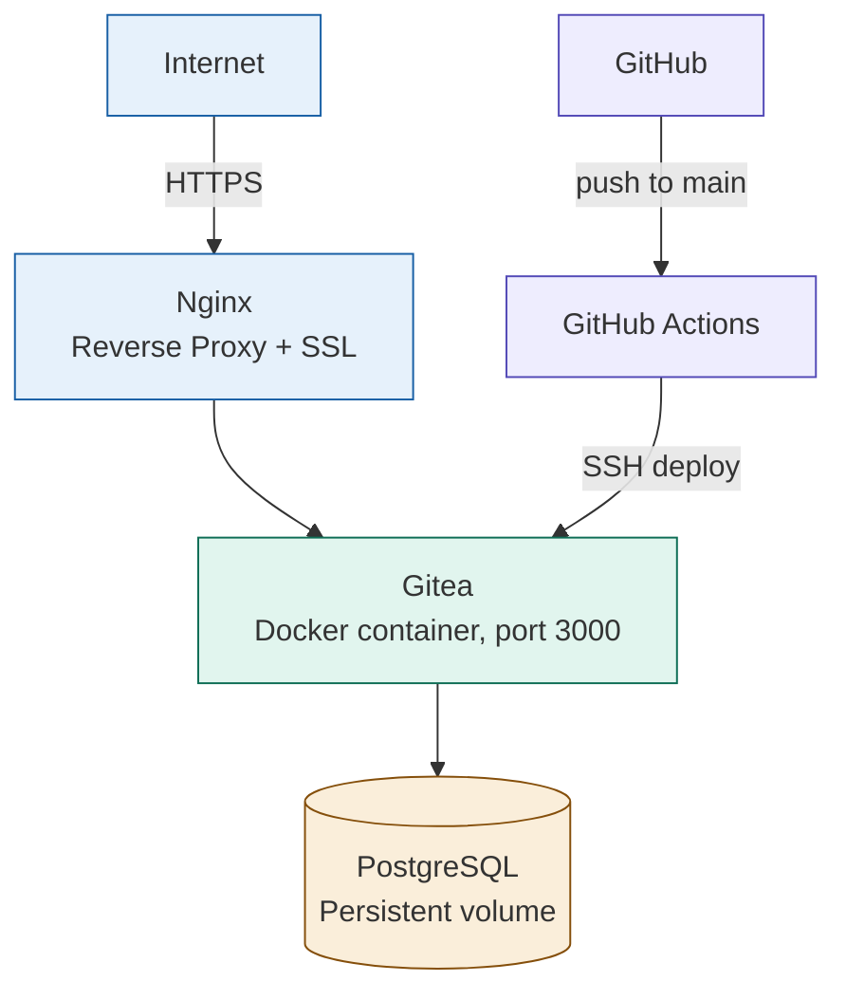

# Gitea — Self-Hosted Git Server Deployment

A production deployment of [Gitea](https://about.gitea.com/), a lightweight, self-hosted Git service (open-source alternative to GitHub/GitLab), running on AWS with PostgreSQL, Nginx, SSL, and automated CI/CD.

**Live demo:** https://gitea.mhhuzaifa.com

---

## What this project demonstrates

- **Working with official production images** rather than building from source, this deployment uses Gitea's official Docker image, configured correctly for production use (a common real-world DevOps task: deploying and configuring third-party software, not just building your own)
- **Multi-container orchestration** — Gitea + PostgreSQL, connected via Docker networking, both with persistent volumes
- **Git-over-SSH support** — exposing a secondary port (2222) for SSH-based Git operations, separate from the server's own SSH access (22)
- **Reverse proxy tuning** — increased upload limits in Nginx to support large repository pushes
- **CI/CD pipeline** — GitHub Actions automatically redeploys on configuration changes

---

## Architecture



---

## Tech stack

- **Application:** Gitea (official Docker image)
- **Database:** PostgreSQL 16
- **Containerization:** Docker, Docker Compose
- **Web server:** Nginx (reverse proxy + SSL termination)
- **CI/CD:** GitHub Actions
- **Infrastructure:** AWS EC2
- **SSL:** Let's Encrypt (Certbot)

---

## Running locally

```bash
git clone https://github.com/mhhuzaifa223-pixel/gitea-deployment.git
cd gitea-deployment
docker compose up -d
```

Gitea will be available at `http://localhost:3000`

---

## Deployment

```
git push origin main
  → GitHub Actions triggers
  → SSHes into production server
  → Pulls latest configuration
  → Recreates containers with `docker compose up -d`
```

---

## Why Gitea?

Many companies self-host their own Git infrastructure for security, compliance, or cost reasons rather than relying solely on GitHub/GitLab cloud services. This project demonstrates the ability to deploy and properly configure that kind of internal developer tooling — a real, common DevOps responsibility.